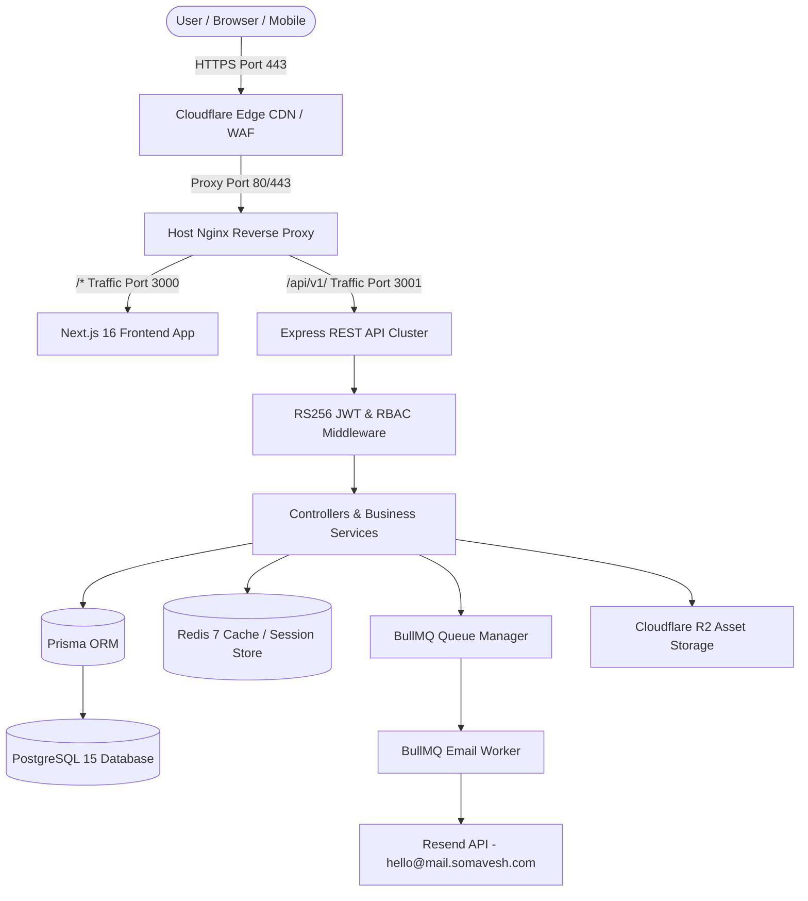
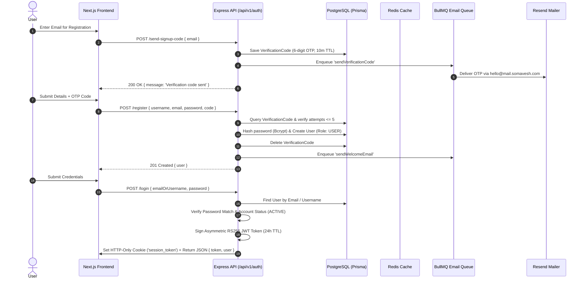
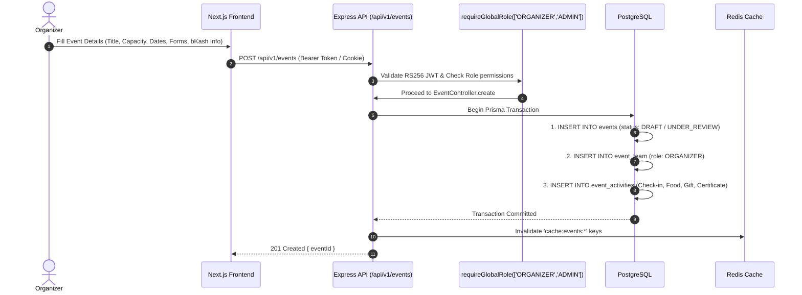
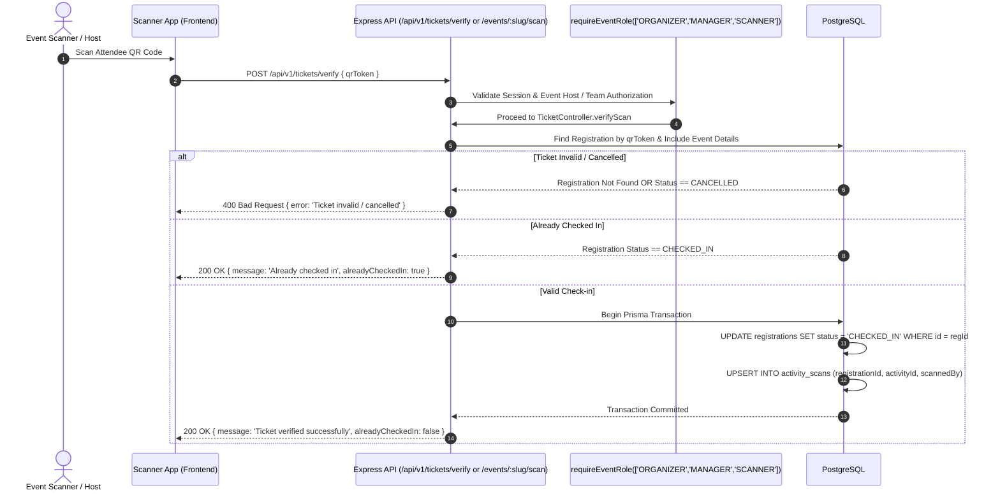
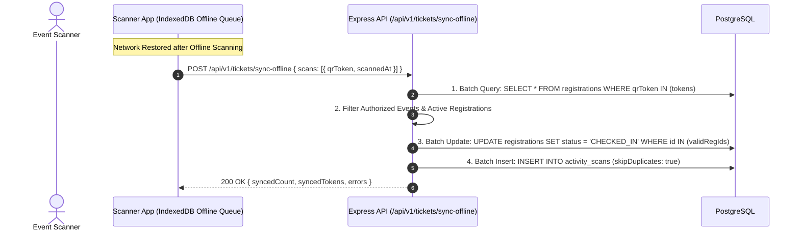
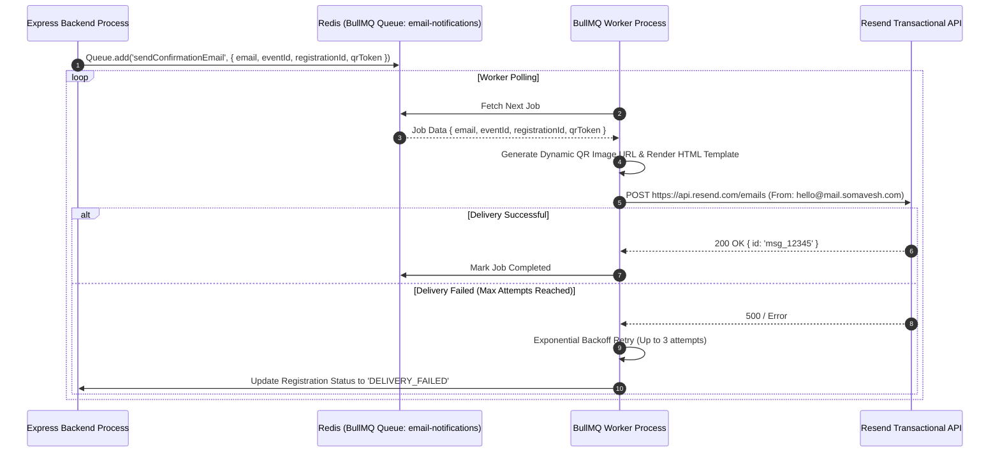
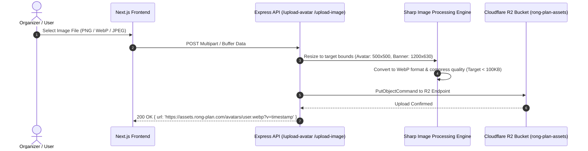
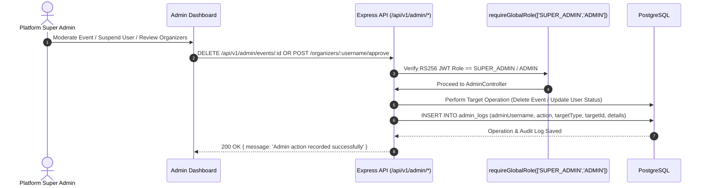

# Somavesh Event Platform — Data Flow Architecture

This document defines the data flow architecture of the **Somavesh Event Platform** (`https://somavesh.com/`). Every diagram maps the actual current implementation across the Frontend (Next.js 16 / React 19), Express REST API, Middleware, Controllers, Services, Prisma ORM, PostgreSQL, Redis, BullMQ Queue, and External Integrations.

---

## 1. System Topology Overview



---

## 2. User Authentication & OTP Flow



---

## 3. Event Creation & Organizer Provisioning



---

## 4. Free / Manual bKash Event Registration Flow

```mermaid
sequenceDiagram
    autonumber
    actor Participant
    participant FE as Next.js Frontend
    participant API as Express API (/api/v1/events/:slug/register)
    participant RegSvc as RegistrationService
    participant DB as PostgreSQL
    participant Queue as BullMQ

    Participant->>FE: Select Ticket & Enter Details (+ bKash Transaction ID if paid)
    FE->>API: POST /api/v1/events/:slug/register
    API->>RegSvc: registerForEvent(eventId, userId, ticketTypeIds, details)
    
    RegSvc->>DB: Begin Prisma Transaction
    DB->>DB: 1. Lock Event Row: SELECT capacity FROM events WHERE id = $id FOR UPDATE
    DB->>DB: 2. Check Capacity & Ticket Availability
    DB->>DB: 3. Check Duplicate Registration / Team Membership
    RegSvc->>RegSvc: 4. Generate Cryptographically Secure QR Token (UUIDv4)
    DB->>DB: 5. INSERT INTO registrations (status: CONFIRMED, paymentStatus: COMPLETED/NOT_REQUIRED, qrToken)
    DB->>DB: 6. INSERT INTO registration_ticket_types & registration_teams (if team)
    DB-->>API: Transaction Committed
    
    API->>Queue: Enqueue 'sendConfirmationEmail' { email, eventId, registrationId, qrToken }
    API-->>FE: 201 Created { registrationId, qrToken }
```

---

## 5. QR Code Ticket Verification & Check-in Flow



---

## 6. Offline Check-in Synchronization Flow



---

## 7. Background Worker & Transactional Email Processing



---

## 8. File Upload & Asset Compression Flow (Cloudflare R2)



---

## 9. Admin Platform Moderation Flow


